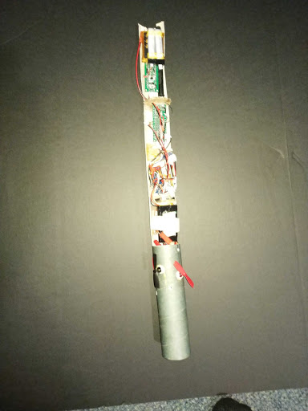
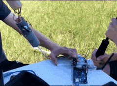
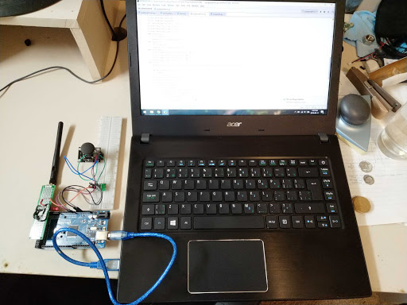

# Rocket-Telemetry-Project
This project was originally made for my grade 12 physics term project. At the time of writing this almost all of the code for this project has been lost. Below is some information and images of the completed project

Summary: 
This project involves the use of an arduino nano packed tightly into a rocket with the goal of using RF transceivers to transmit live GPS and altitude data from the rocket to a ground station. As well as be able to control 4 small brushed motors with propellors mounted on the rocket to control descent and deploy a camera on the rocket using a servo motor to capture footage of the descent. 

This was accomplished mainly using easily available breakout boards for everything from RF serial communication to GPS data collection. These modules were interfaced with an arduino using i2c and serial communication.

Footage of succesful telemetry communication:

	

GPS data plotted in google earth

	

Rocket Electronics:
 <li>GPS</li>
 <li>9DOF IMU</li>
 <li>2.4ghz radio</li>
 <li>3 LiPo batteries</li>
 <li>Camera + Camera DVR</li>
 <li>Camera Servo</li>
 <li>4 Brushed motors + PDB</li>
 <li>Arduino Nano</li>
</ul>

	

	

Ground Electronics:
<ul>
 <li>2.4ghz radio</li>
 <li>joystick</li>
 <li>Connected to Laptop</li>
 <li>Interfacing with a python program via serial communication 
  to give live data of the rocket and save it to a csv</li>
  <li>Arduino Mega</li>
</ul>

	

[Slideshow presentation for class (Google Slides)](https://docs.google.com/presentation/d/1pYWoD7gOyriHVLa-mrH2qRpS772lOJ7CilTVoHMLk8A/edit?usp=sharing "Powerpoint Presentation for Class (Google Slides)")

Please send me an email huntergwhyte@gmail.com if you want to know more about this project!
